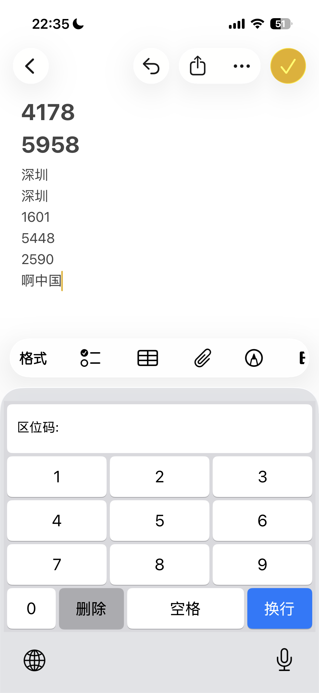

# Position Code Input Method

An iOS system-level input method based on GB2312 position codes, supporting quick Chinese character input by entering 4-digit numbers.

## Screenshots



## Features

- ✅ **System-level keyboard extension** - Usable in any App
- ✅ **Full GB2312 support** - Covers all common Chinese characters
- ✅ **Real-time preview** - Displays corresponding Chinese characters while entering position codes
- ✅ **Code table lookup** - Built-in complete GB2312 code table lookup function
- ✅ **Clean interface** - Clear numeric keypad layout
- ✅ **Convenient operation** - Long press (0.5 seconds) the "0" button to switch keyboards

## What is Position Code?

GB2312 position code is a Chinese character encoding method that maps each Chinese character to a 4-digit code:
- First 2 digits: Area number (01-94)
- Last 2 digits: Position number (01-94)

Examples:
- `1601` → 啊
- `3021` → 镜
- `5448` → 中
- `2136` → 的

## Installation

### 1. Compile and Install

```bash
# Clone the project
git clone <repository-url>
cd ChineseCharacterPositionCode

# Open the project with Xcode
open ChineseCharacterPositionCode.xcodeproj

# Connect an iOS device, select the device and run (Command + R)
```

### 2. Add Keyboard

1. Open the main App on your device
2. Click the "Instructions" tab
3. Tap the "Open Keyboard Settings" button
4. In the keyboard list, tap "Add New Keyboard..."
5. Find "Position Code" in the third-party keyboard list
6. Tap to add

### 3. Use the Keyboard

1. Bring up the keyboard in any input field
2. **Long press (0.5 seconds)** the "0" button, then select "Position Code"
3. Enter 4-digit numbers to input the corresponding Chinese characters

## Instructions

### Keyboard Layout

```
┌─────────────────────────┐
│  Position Code: 1601    │
│  啊                     │  ← Input display area (real-time preview)
└─────────────────────────┘
┌───┬───┬───┐
│ 1 │ 2 │ 3 │
├───┼───┼───┤
│ 4 │ 5 │ 6 │
├───┼───┼───┤
│ 7 │ 8 │ 9 │
└───┴───┴───┘
┌───┬─────┬───────┬─────┐
│ 0 │Back │ Space │Enter│
└───┴─────┴───────┴─────┘
```

### Function Keys

- **Number keys 0-9**: Enter position codes
- **0 button**: **Tap** to enter digit 0, **Long press (0.5 seconds)** to switch keyboard
- **Back**: Delete entered digits or characters
- **Space**: Enter space
- **Enter**: Enter line break

### Input Process

1. Enter 4-digit position code
2. System automatically displays corresponding character preview
3. After completion, the character is automatically inserted
4. Continue entering the next character

## Code Table Lookup

The main App provides a complete GB2312 code table lookup function:

### Features

- **Browse by area**: Select areas 1-94 to view all characters in that area
- **Search function**: Enter position codes to quickly locate
- **Character details**: Tap characters to view detailed information
- **Copy function**: Copy position codes or characters

### Area Distribution

| Area | Content |
|------|---------|
| 01-09 | Special symbols |
| 10-15 | Numbers, letters, etc. |
| 16-55 | Level 1 characters (3755, sorted by pinyin) |
| 56-87 | Level 2 characters (3008, sorted by radicals) |

## Common Chinese Character Position Codes

### Level 1 Common Characters (Areas 16-55)

- `1601` 啊 - `1602` 阿 - `1603` 埃 - `1604` 挨
- `3021` 镜 - `3022` 盅 - `3023` 忠 - `3024` 钟
- `5448` 中 - `5449` 图 - `5450` 圄 - `5451` 团

### High-frequency Characters

- `2136` 的
- `5027` 一
- `4239` 是
- `1823` 不
- `1670` 了
- `2934` 人
- `1862` 我
- `2050` 在
- `2123` 有
- `2976` 他

## Technical Architecture

### Project Structure

```
ChineseCharacterPositionCode/
├── ChineseCharacterPositionCode/    # Main App
│   ├── ChineseCharacterPositionCodeApp.swift
│   ├── ContentView.swift             # Main interface (code table + instructions)
│   └── GB2312Data.swift              # Position code data model
├── PositionCodeKeyboard/             # Keyboard extension
│   ├── KeyboardViewController.swift  # Keyboard implementation
│   └── Info.plist                    # Keyboard configuration
└── README.md
```

### Core Technologies

- **SwiftUI**: Main App interface development
- **UIKit**: Custom keyboard implementation
- **Keyboard Extension**: iOS keyboard extension
- **GB2312 Encoding Conversion**: Position code to Unicode conversion

### Position Code Conversion Principle

```swift
// GB2312 encoding calculation formula
let highByte = area + 0xA0      // Area number + 0xA0
let lowByte = position + 0xA0   // Position number + 0xA0

// Convert to Unicode using GB_18030_2000 encoding
let gb2312Bytes: [UInt8] = [UInt8(highByte), UInt8(lowByte)]
let character = String(bytes: gb2312Bytes, encoding: .GB_18030_2000)
```

## System Requirements

- iOS 14.0 or higher
- Xcode 14.0 or higher
- Real device testing (keyboard extensions don't support simulators)

## FAQ

### Q: Why can't I see the keyboard after adding it?

A: Please ensure:
1. Completely uninstall the old version App before reinstalling
2. Use a real device (not simulator)
3. Correctly add the keyboard in system settings
4. Try restarting the device

### Q: How to switch to the position code keyboard?

A: In any input field, **long press (0.5 seconds)** the "0" button (or the globe icon of other keyboards), then select "Position Code" from the popup menu.

### Q: Why can't some position codes find characters?

A: The GB2312 standard doesn't have corresponding characters for all positions, some positions are empty or reserved.

### Q: Can I input special symbols?

A: Yes, areas 1-9 contain various special symbols, which can be viewed in the code table lookup.

## Development Plan

- [ ] Support favorite function for common characters
- [ ] Add reverse lookup function (enter characters to find position codes)
- [ ] Support dark mode